# 
*Star Signs*

In astrology, the zodiacal year does not follow the calendar, but the seasons. It therefore begins at the spring equinox on 21 March. Before listing the different astrological signs, it is important to make a few clarifications:

* Each sign has one or more ruling planets
* The signs are divided into four categories: fire, water, air and earth.
* Each element comprises three signs.

## **The signs**

### Aries (21 March-19 April)

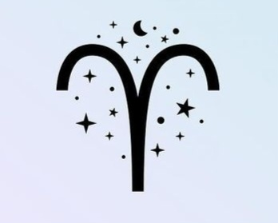

Aries is a fire sign ruled by Mars. Aries is the first sign of the zodiac. It is associated with the birth of the Roman Empire and the birth of spring. It's a masculine fire sign, which means that Aries moves or decides quickly when that's its intention. It's also a cardinal sign, which makes it difficult to influence or shake up. They have the ability to bring about what they want, but their plans can sometimes backfire. He is quick-witted and can act fleetingly. Often intelligent, he has no time to waste with those who risk wasting it or with those he considers slower than himself.

Aries people are courageous and ambitious. They don't hesitate to take risks to achieve their goals. Their dynamism can disconcert many people, although this quality is expressed more in their professional than in their private lives. They prefer jobs that are meaningful and useful to society. They are often found in large organisations, such as schools, hospitals, the army or the justice system. In their private life, Aries people are generally loving and respectful of their family. In most cases, they prefer the stability of a couple, even if they have to fight against an impulsive nature that may prevent them from staying with one and the same partner.

Aries is a homebody and their home is their landmark. They like to decorate and maintain it. In this respect, they tend to impose their point of view on their partners. Aries values loyalty, so they ask their partners to be faithful. They will support their partners if they are in doubt. Impatience and impetuosity, backed up by a bubbling temperament, are the other side of the coin.

When it comes to finances, Aries can be naïve and spendthrift. They may have a tendency to buy more than they really need, without taking any particular care over what they buy. Aries loves sports cars and doesn't spare any expense when it comes to them. Selfishness and a lack of common sense are the sign's failings. They are not always demanding and become impatient quickly unless the subject is of interest to them.

Courage, strength of character, intelligence, loyalty and humour are the great qualities of Aries. He is sociable, generous and has a good spirit. His idealism often leads him into politics or working for society. He is caring, generous and caring. He is an idealist and will fight to protect the rights of others. Local or national politics can be his field of choice.

Aries can sacrifice if it is for the happiness of its children. He sees education as a key to success. He is not the type to complain or to complain, gets better with age, because he is perseverant and never forget his sense of humor over time. He is faithful in love as long as this feeling is alive. If it fades, he will tend to look elsewhere. Aries is often an artist, with a predilection for graphic arts. It can also shine in mechanics or engineering. He is often found as a software developer, where he can show off his innovative skills.

### Taurus (20 April-20 May)

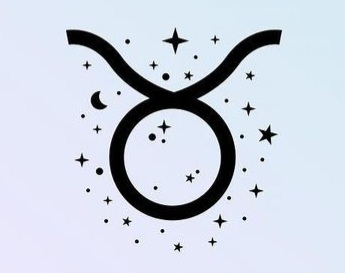

Taurus is an earth sign ruled by Venus. Taurus is a female earth sign. By nature, he is meticulous, sensitive and capable. He can achieve many things, provided that he is allowed to do it at his own pace. It is a fixed sign. The combination of earth and fixity makes it the most stubborn sign in the zodiac. Taurus is loyal, reliable, unchanging and stable. He has difficulty managing situations that require him to adapt. Taurus is practical, persevering and strong.

He loves money and comfort, which can make him materialistic. It is made for practical careers that present few surprises but offer a comfortable income. His artistic fibre is highly developed and he can express it in his work, hobbies or any activity that arouses his interest. Taurus is sociable. He makes friends easily and loves to hang out. Her sense of humor and affable character make her the ideal guest for any event. He is interested in many subjects and tends to delve deeper into the topics that arouse his interest.

Taurus fears poverty. His sense of responsibility is acute. He will always be looking for a stable job that provides sufficient income for him and his family. If he can be ambitious, he can be satisfied with a stable and comfortable position. Taurus can spend a lot when it comes to travel or hobbies. In difficult times, he knows how to be careful and does not spend too much. Taurus family life is fundamental. He is generous to his loved ones. Taurus is usually a family member that can be relied upon. He always cares for his loved ones, even if his stubbornness can lead him to be too insistent. He does not judge other people’s flaws and knows how to advise them well.

Taurus tends to be stubborn when it is interested in a subject. This tendency can make it tiring for those around it. But his natural common sense often prevents him from getting there. Taurus has a keen sense of beauty, often creative or artistic, and is attracted to fashion, decoration, make-up and hairdressing. So many subjects that lead him to the world of fashion and show business. This sign is associated with voice and music. Taureau loves to sing and is found in choirs or playing and singing in groups, just for fun. He is also a hypnotherapist, a profession that uses voice as a work tool. He is often good at cooking.

Taurus is brave. Among his qualities are common sense, loyalty, a spirit of responsibility and pleasant contact with others. Taurus is brighter than we think. It will be difficult to get the better of him in the discussion, because he usually knows what he is talking about. Taurus is a true friend and reliable colleague.

### Gemini (21 May-21 June)

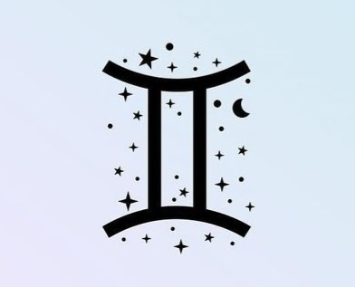

Gemini is an air sign ruled by Mercury. Gemini is a sign to the sharp mind and endowed with a beautiful intelligence. His connection with Mercury, the Roman god who took on the role of messenger, offers him innate communication talents. Gemini is friendly and sociable. Its mutable appearance allows it to adapt easily to change. He may be comfortable with numbers, which leads him to careers in banking, accounting or statistics. The Gemini is quick to work, he is gifted for intellectual thinking and organization. It is a sign more oriented towards the mind than to emotions, his mind is rarely idle. He can be difficult in negotiation and shows real business skills. He must learn to control his natural impulsivity as well as his tendency to intimidate those who are not able to stand up to him.

Gemini is often accused of not knowing how to hold on to something for a long time and of having a superficial knowledge of the subjects he claims to master. But these judgments are unfounded, the Gemini actually shows determination when it comes to a subject that interests him. He knows how to devote an in-depth study. He can be a hard worker who does not count his pain or hours. He can be naturally worried and it is not uncommon for him to get upset about things that others consider uninteresting. They may feel insecure in their professional or private lives even if everything seems to be going well. He will therefore tend to need reassurance, without his entourage really knowing it. Gemini may be deprived of love, security or attention, or suffer from material deficiencies during childhood. Gemini will devote his energy to finding a way to earn a living and the right person to love. This process can take time.

Gemini can be sharp, sometimes to the point of shattering a viable relationship. It can be worn on alcohol. They may be prone to excessive consumption, especially of clothing and accessories. As he is a natural conservator, the Gemini’s cupboards may soon overflow.

The Gemini will do what it takes to make their relationship last. However, if his relationship fails, he will soon start looking for a new relationship. Gemini will work hard so that his family does not lack anything, that his children receive a good education and can take a good start in life. He reads and learns all his life and his field of knowledge is extensive. Gemini is often talented. It is a being with a big heart who does not hesitate to help his neighbor. However, his emotional weakness leads him to quickly lose patience with lame ducks. His social life is generally rich. He is always there and we have a good time with him. Gemini is a mutable sign, we see it regularly changing work and going from project to project.

### Cancer (22 June-22 July)

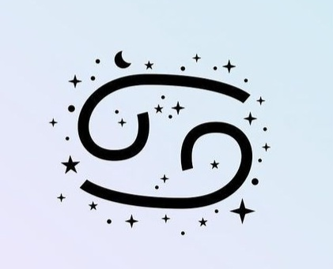

Cancer is a water sign ruled by the Moon. Cancer is ruled by the Moon, making it a sensitive and emotional sign. It is a female water sign, so it is very intuitive, caring in nature and expresses the need to help others and protect your family. The fact that it is a cardinal sign is the other side of the coin. Cancer is hard to influence. It is also much harder than you might think.

Cancer is shy when young. If he manages to solve this problem as he grows older, he will still avoid being in the limelight. Cancer has the reputation of being a homebody, but this does not prevent it from having a travelling soul. It is often found in positions that require some mobility and lead to meeting many people during the same day.

Cancer tends to emancipate quickly. They may be called upon to take on responsibilities at an early age, especially when they are the eldest in a large family. He will continue to take a responsible attitude towards his relatives even if they have reached the age of maturity. The family is a pillar of Cancer. The relationship he has with his mother is usually very intense, to the point of remaining very close to her or getting confused with her. In most cases, Cancer takes care of its children and relatives. He cooks well and makes the house a cozy nest. Cancer is smart and does well in business.

This is a sign that is easy to reach. He is often found in careers that confront him with people, for example a store or a restaurant. Cancer frequently works in sales, especially when it is related to habitat. It is also found in the world of finance, real estate, or insurance. He loves helping others buy or insure their homes.

It is not uncommon to meet Cancer in the world of education or health-related professions. It is a sign that loves history. His memory is excellent. He demonstrates a true quality of listening and an unmistakable talent for defusing conflicts. He is a born counselor. If he can stand the noise, chaos and arguments in a professional setting, at home he needs peace and quiet. When faced with difficulties, Cancer can close in on itself, not facilitating the work of those around it to come to its aid. He can be naturally worried about his family and sometimes money. If it gives an impression of sweetness, Cancer is not the type to be influenced. He can be lazy and expect others to look after him.

Cancer will not stay with a partner who treats it badly. He will still try to stay in touch with his family members, even after a separation, as long as it is done with respect. One of the drawbacks of Cancer is that it tends to hurt those it perceives as weak. It is not uncommon for him to be harsh towards his sons-in-law and sons-in-law. And then, it happens that Cancer behaves strangely in the face of money. Fortunately, it is a sign that often shows common sense. He knows how to be reasonable with respect to others and financial matters. However, her versatile nature and tendency to make emotional decisions can play tricks on her.

### Leo (23 July-22 August)

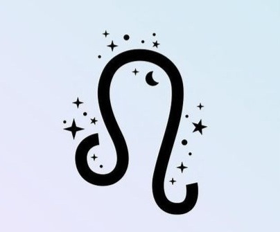

Leo is a fire sign ruled by the Sun. Leo is a sign of male fire. He knows how to put the means to get what he wants. Leo has a logical and organized mind. As a fixed sign, it does not easily change direction and does everything in its power to maintain the status quo.

Leo is gifted by nature, to such an extent that it can be annoyed by those who do not have the same efficiency. He does not understand that opportunities can be missed. Sometimes the first difficulties in life make Leo ambitious and autonomous. He is attracted by prestigious professions, such as the aeronautical or entertainment industry, banking, publishing or tourism. It is frequently found in the commercial or administrative branches of these fields. It is not uncommon to see him at the head of his own company, he is indeed the type to manage his boat. Leo loves music and often plays an instrument, sings or dances. It is common to see him on stage in the spotlight. Speaking in public does not scare him at all. He is comfortable with communication technologies.

Leo is not always glamorous or charismatic, nor does it meet success systematically. He then expends considerable energy to get his children as far away in life as possible. Leo tends to get married and start a family when he is young, and his children will soon be at the center of his universe. Leo is an affectionate character gifted in love and brilliant when he becomes a parent. Honesty, decency, loyalty and generosity define Leo who can also be arrogant and unpleasant. It is often driven by good moral values.

Leo can look great, he can be charged with great responsibilities and ask to be treated with the greatest respect. But it is above all an individual who loves to offer and receive affection. Under normal circumstances, he is warm, generous, sociable and popular. He can also be moody and irritable when under pressure or out of shape. Leo puts his heart and soul into everything he does. He can work like a titan but can also bend under the weight of fatigue when it falls on him. Leo regularly needs holidays to recharge his batteries. He gives the image of someone who is confident and successful. But this confidence can quickly fade. Leo is very sensitive, he is susceptible and does not tolerate being mocked. Although he is a natural homebody and rather good at cooking, he also likes to go out and share dinner with friends, accompanied by a glass of wine.

He may have luxury expenses far beyond his means. He enjoys being an important part of society and appreciates the lifestyle that comes with success. Leo is proud and always sets the bar high in everything he does. He is often honest and upright. But Leo can be snobbish and contemptuous. The arrogance that characterizes him can even become unbearable.

In love, Leo is loyal and will work hard for his partner. The fixed nature of this sign favors long-term relationships, but he will look elsewhere if his or her partner does not love him with sincere and true love. Leo can be very bitter.

### Virgo (23 August-22 September)

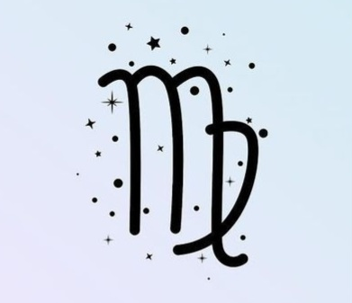

Virgo is an earth sign ruled by Mercury. Virgo is one of the most hardworking signs in the zodiac. She loves meticulous work and can’t stand being pressured. It is found in the health sector, whether conventional or alternative medicine.

As a child, Virgo may encounter difficulties with authority, with her parents or teachers who may be unnecessarily severe or critical of her. It is possible that Virgo child entered his parents' lives at a difficult time, or that having a child changed their lifestyle to the point of creating tensions in the home. The resulting frustration can be passed on to the child. A not really happy childhood can lead Virgo to leave her parents earlier than expected, by settling with her partner or getting married. When this happens, Virgo then commits to make her relationship work. It may, however, fail because the couple is too young, faces economic difficulties or simply lacks experience.

Virgo may look for other ways to start her adult life early, by enlisting in the military, volunteering abroad, or riding on boards, for example. This is not a bad idea, it is enough to see the number of Virgo in the world of entertainment, to convince yourself. Virgo, who has studied, often leads a career in the world of communication, publishing and media. Sometimes this sign has a talent for singing. Most often she is a music lover. As an earth sign, his emotional pan is very powerful, allowing him to escape by listening to music or reading a book.

Virgo takes her responsibilities seriously. When she engages in a relationship, her family can count on her to support them. Sometimes Virgo is so deeply involved in her work that she forgets about her partner and children. If she finds herself with a difficult, demanding, pushy or tiring partner, she will prefer to leave him rather than live in a tumultuous relationship. She loves small animals, and it is not uncommon for her to have a cat, dog or rabbit. She cannot abandon them.

The spirit of Virgo is rather academic, which does not prevent her from having fun, enjoying holidays and taking time off to do things that interest her. Her sense of humor and reliability, as well as her good heart, make Virgo a wonderful partner in friendly relationships. His ability to listen and empathy makes him a leading advisor. Despite her good intellectual functioning, Virgo loses her means when put under pressure. Earth signs are always more comfortable when given time to think and do things at their own pace. In a hurry, they often make mistakes.

Virgo can be naturally anxious, which makes it difficult to bear when this trend is pushed to the extreme. Virgo is a perfectionist and can be critical of others or herself. Although ambitious, when faced with potential success, she sometimes ruins her chances.

### Libra (23 September-22 October)

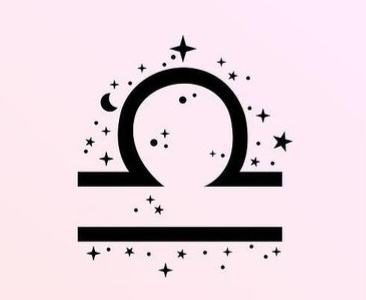

Libra is an air sign ruled by Venus, just like Taurus. From a technical point of view, Libra is a confusing sign. On the one hand, it is the only sign represented by an inanimate symbol and on the other hand, it is a male sign that is ruled by Venus, a highly feminine planet. It belongs to the air element, which makes it cold and detached, logical rather than emotional. These characteristics are moderated by the cardinal quality of the sign. With this strange mix of passivity/aggressiveness, should we be really surprised to find that Libra is terribly undecided?

Libra is a sign that masters tact and diplomacy. She is friendly with all who approach her. Its detached and introspective air makes it difficult to read. Some Libras spend their lives looking for the ideal partner. Others are so independent that after trying a few relationships, they decide to stay alone and do things their own way. Libra likes to flirt, which is rather flattering and pleasant as long as no one takes themselves too seriously.

The personality of Libra is sweet and pleasant. She can exercise a profession in which form counts as much as substance. She will be a sympathetic dentist, lawyer or accountant who will see her clients grow both in altruism and skill. She likes to bring people together and solve problems in a gentle way. So she’s found in arbitrage, and negotiation. She’s fine-minded and good with her hands. She is often seen as a stylist, engineer or in a profession in the cosmetics industry. She is also very present in the world of music and dance. Law is also a favorite universe for Libra. His constant desire to find agreement between people and his hatred of injustice make him a leading jurist.

What is certain is that Libra will always be looking for a profession that makes it possible to earn a good living. It aspires to a high standard of living. She is generous to the people she loves, she will make sure that her partner does not lack anything, which will not prevent her from wanting her financial independence. Libra loves housework and it is not uncommon for her to be good at cooking or growing fruits and vegetables.

This is a cardinal sign. Libra has a form of rigidity related to the fact that it observes rules and refers to a world of codes and conventions. It seeks compromises and agreements within this framework and can be uncompromising with the impulses that do not fit into the perimeter. Since Libra does not particularly like to be faced with itself, it seeks partners, friends and colleagues. It will have no difficulty in creating a web of relationships, among which few will be truly close to it. Libra may be a delightful companion, but when she is in a bad mood, she can be deeply unpleasant and will not hesitate to say what she feels or hurt for pleasure. Libra is really a very confusing sign, divided between what it has good and what it has less good.

### Scorpio (23 October-21 November)

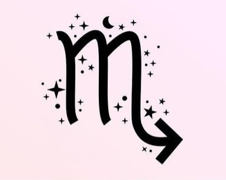

Scorpio is a water sign ruled by Mars and Pluto, although the latter is officially considered a dwarf/minor planet and no longer belonging to the solar system. Here is another very confusing sign. It is a sign of feminine water that one might think sweet and weak while Scorpio is not far from the opposite. The fact that it is a sign of water implies that Scorpio makes its decisions according to his feelings. With him, what is valid one day is not necessarily valid the next. This is a sign of extreme sensitivity, which tends to be easily struck or injured. Scorpio goes to great lengths to conceal its weaknesses and vulnerability, so that others do not take advantage of it.

It is a passionate sign, of type "all or nothing", which can push situations to the extreme. For example, Scorpio can be abstinent or very alcohol-conscious; it can be very frugal or frantic; it can be generous in some ways and selfish in others. It is a sign that will be kind and helpful or its opposite. It depends on his mood. No one is more charming and hospitable when Scorpio wants company. But if he doesn’t, he will be able to express it unequivocally.

Scorpio is very persuasive, which makes him an excellent seller or a very good advisor. At the extreme, he can be manipulative or play the intimidating card. He is found in the health professions, as a doctor or healer. Scorpio is very intuitive, it reads people better than anyone else. He will be an excellent psychologist, an intuitive therapist. Some find their way into the armed forces. Scorpio takes its work very seriously and often works very hard to gain the respect and approval of others. Because of his lack of self-confidence, Scorpio likes to hold power in the shadow of the throne. There is a lot of Scorpio in finance, often in credit, insurance, investment and other positions. It is also found in the law specialized in wills and trust funds.

The voice of Scorpio is one of its main qualities. Often of a tessiture that tends towards the low, pleasantly modulated and worked, the Scorpion uses it to convince. Contrary to what many astrology books say, Scorpio is not overly sex-oriented, nor is it unbearable. It is a sign under the light of passion that likes to be found attractive. The Scorpion likes to shock and will have fun teasing, but above all he is a loyal friend and a first-rate host.

Some Scorpions love animals and care for them better than anyone else, others will have a great fibre with children. Most people love family life, especially when it is animated by children and grandchildren.

### Sagittarius (22 November-21 December)

Sagittarius is a fire sign ruled by Jupiter. Sagittarius is a male fire sign that tends to think and react quickly. He may have a good overview of a situation but express difficulties in considering the details. It is a mutable sign, so it is prone to adapt and blend easily into a new environment. Sagittarius may change regions or even countries several times in his life.

Sagittarius can have two distinct natures. He can be discreet, timid, lacking in self-confidence and happy only when with family or close friends. But he can also be more outgoing than any other zodiac sign. Sagittarius is hardworking. He may be successful in his career, but his lack of self-confidence or risky decisions can make him fall or prevent him from reaching his full potential. Sagittarius is a sign of luck, he will fall back on his feet after each test. He may be attracted to astrology and spiritual activities. His thinking is often philosophical, but he will tend to move away from the religion of his parents or the people who raised him. It may appear to be superficial when it is not. Sagittarius is a studious thinker.

Sagittarius is active, it has trouble staying in place for too long. He likes movement and can’t stand being tied to a particular place, especially in the context of his work. Sagittarius will tend to choose a trade that allows him to be in contact with many people. It may be a profession that leads him to move, or a hobby that encourages him to go out and meet people. Contrary to what it gives to see, Sagittarius, like all signs of fire, gets tired easily and needs a rest time to recharge its batteries.

Sagittarius can be a priest, teacher, merchant, electrician, carpenter, travel agent, bus or taxi driver, tailor, etc. He is comfortable in trades in contact with the public. Vet, falcon trainer or instructor in the air force are occupations that may also appeal to him. We find him astrologer, clairvoyant, cartomancien or chiromancian. Sagittarius is skilled with his hands. He loves to build and renovate. He likes to be outdoors, travel and explore the surroundings. When young, Sagittarius enjoy active holidays in fun places. Most also enjoy taking care of pets.

In love, Sagittarius does not tolerate harassment or deprivation of liberty. He abhors injustice. His sense of honesty can make him awkward and likely to hurt, but it is never intentional. The child in him is alive and well, making him an ideal playmate. If the childhood of Sagittarius was not happy, it can be a sad and lonely adult. In this situation, the importance of his partner will be decisive.

### Capricorn (22 December-19 January)

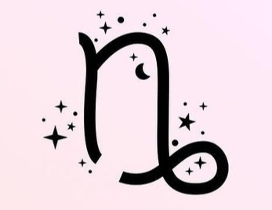

Capricorn is an earth sign ruled by Saturn. Capricorn is a feminine earthy sign characterized by a strong common and practical sense. It pays great attention to detail. It is also a cardinal sign, which makes him a person who should not be pushed or forced to do what he does not intend to do. Capricorn does not rush. He tends to get what he wants in the long run. When he puts his eye on a person, he can wait for him a lifetime if it is the time needed to get it. He often chooses an older partner, sometimes even much older.

In one way or another, all Capricorns are ambitious, for themselves or their children. They want the best education for their offspring. By being practical, sensitive, realistic and responsible, Capricorn takes life very seriously, which does not prevent him from having a strong sense of humor. Some Capricorns aspire to remain single, not least because they can be shy or clumsy with love things. But also because they will tend to stay with their parents for a long time to take care of them. When entering into a relationship, Capricorn takes it very seriously and will do everything to make it work.

Capricorn can be capricious and the type to worry about anything. He can be overly touchy and quite unbearable with his irritable attitude. Capricorn ambition can sometimes lead him into dubious activities, even if in general he is the kind to follow the right path. His career choices can lead him anywhere and all professions attract him, with a preference for accounting and banking. It is not uncommon for him to aspire to own his piece of land. Agriculture and real estate may be of interest to him. Traditional astrology associates this sign with all forms of science.

The fact of being installed between the two less conventional signs of the zodiac (Sagittarius and Aquarius) can slightly blur on Capricorn. He may have rather rare interests and talents. He can be an astrologer, a chiromancienne or a clairvoyant. Capricorn is generally a good dancer. Some are antique collectors, stamp collectors, great cooks or champions of unusual sports.

Capricorns are patient, realistic and responsible; they take life seriously, so they need security that they don’t always get. He may spend a lot of time working, just to pay his bills, but his ambition and desire for status somehow leads him to climb the ladder towards success. As an entrepreneur, Capricorn needs a partner to take care of sales and marketing. He can be a pinaileur, which annoys more than one. He may also have a tendency to know everything, better than anyone else. Capricorn is faithful and reliable. He is not the type to be easily sown, and will recover painfully from broken relationships.

### Aquarius (20 January-18 February)

Aquarius is an air sign ruled by Saturn and Uranus. The Aquarius is a fixed male air sign. It is often mistakenly thought to be a sign of water because of its symbol, but it is an air sign. Air signs are often more comfortable in the world of ideas than in that of emotions. In fact, Aquarius is never short of ideas although he may have difficulties to put them into practice. They may spend a lot of time thinking or talking about their ideas rather than realizing them. Inventive, intelligent and often ingenious, Aquarius will more often find the solution to the problems he encounters than the other signs of the zodiac. He seems to have confidence in himself, but sometimes it is only an impression. Shy, he will find it difficult to open up to others from this lack of confidence.

People under this sign of kindness and humanity often work for the good of others. They can engage in humanitarian causes and take this mission so seriously that they neglect their own families. Aquarius is headlong and often late, because he tends to do everything at the last moment.

Aquarius loves teaching and has the patience to learn. He speaks softly, expresses himself clearly and always puts his ideas in a logical order. He is often found in professions characterized by altruism. He is generally attracted to computer science. If he finds a job focused on technology and whose human side is prominent, Aquarius will be where it should be. He needs a family, but he also aspires to independence. An overwhelming partner or a high-demand child will tend to suffocate. Sometimes the role of parent does not appeal to him and he prefers the company of animals to that of children or even adults. Aquarius will be happy if his partner understands his need for space or to sometimes get away from his work, routine and home. Intelligent, friendly, kind and human, Aquarius is easy in friendship, even if he tends not to put himself out easily. Conscientious, he does not leave his family in need but may be blind, sometimes even deliberately, to the underlying needs and feelings of his children or loved ones. He will be more comfortable with causes and ideals than with the daily routine. In some cases, the disorder in his home may reflect this lack of interest.

Aquarius can show great originality in his way of dressing or living, trying to show that he is different from others. He may be passionate about astrology, numerology, egyptology. It can also offer a more conventional appearance, knowing that its interests are not. His restless and skeptical mind leads him to seek an alternative way of life. Aquarius conceals a personality under tension by a calm and quiet appearance. His repressed emotions can sometimes explode and lead to irrational behaviour. Therefore, Aquarius is extremely loyal and faithful when he has found the right partner.

### Pisces (19 February-20 March)

Pisces is a water sign ruleded by Jupiter and Neptune. It is a female water sign. Intuition, feelings and emotions are at the heart of her decisions and actions. The fact that it is mutable leads the Pisces to adapt better than anyone else to changing circumstances. This is a true quality for Pisces whose life will often have a chaotic tendency, even if it is only one sector of its existence. Pisces may, for example, have a fully satisfying professional life but a very complicated family life.

The early years of Pisces are often difficult, with parents who tend to abandon it. He will leave the parental home prematurely to start his adult life by investing in a romantic relationship for example (often with another Pisces). The relationship does not last long but leaves room for a beautiful friendship with his ex, which he can take care of if necessary. Most Pisces are attached to their family and are good parents and grandparents. The relatives of Pisces can even abuse their kindness. He is not begged to help others, even taking on responsibilities that are not his own. Pisces can not stand to see others suffer and will hurry to help them. Be careful that this assistance is not detrimental to them.

Pisces can be very successful in business, especially when working in commerce or marketing. He easily understands the needs of people and his pleasant nature, which is not in judgment, allows him to pass his ideas in a way envied by many. He makes money by making sure his company offers the right products or services to its customers. Pisces always has a lot of contacts, which will be useful when he wants to broaden his horizon.

Pisces is creative, which leads him to writing, music, art or fashion. He loves repairing used things. With values more spiritual than material, Pisces is rarely wealthy, but he makes sure not to miss anything. It is not uncommon for them to feel insecure and most of them experience poverty at some point in their lives. Pisces is extremely intuitive and is often found in spirituality, clairvoyance, astrology, tarot, etc.

Pisces is a kind of traveller. It can have several places to live at the same time, love life in a camper or live in a mobile home. He loves the sea and often owns a boat. Pisces can be stubborn, clumsy and rather mean when things go wrong, but he is rarely vindictive. He would rather help than hurt others. He usually loves animals. He often has a pet and will work for them.

His tendency to drink too much is a negative aspect of the sign, especially when he is in society or life is difficult with him. Sometimes he gets sick. His ability to keep up is a lifesaver, as well as her natural tendency to see the humorous side of things, even when times are tough. Pisces is a pleasant companion and good friend, although they tend to quickly leave people’s lives when needed.

## **The elements**

We have talked about each astrological sign, but what about the elements and what additional information do they bring?

### Fire signs (Aries, Leo, Sagittarius)

Passion, spontaneity and motivation are the key words here. Like the element itself, the associated signs infuse warmth and light. They can quickly exhaust themselves or cause immense destruction if their overflowing enthusiasm is not well managed. Fire signs are usually quick and effective, they do not waste their time in trifles and do not hesitate to run headlong. They have difficulty understanding why other signs do not systematically tend to do the same when the opportunity presents itself. Fire signs are quick, intelligent and generous. They love deeply and passionately. They are more sensitive than what they give us to see and can be hurt when they consider not receiving as much as what they give.

### Earth signs (Taurus, Virgo, Capricorn)

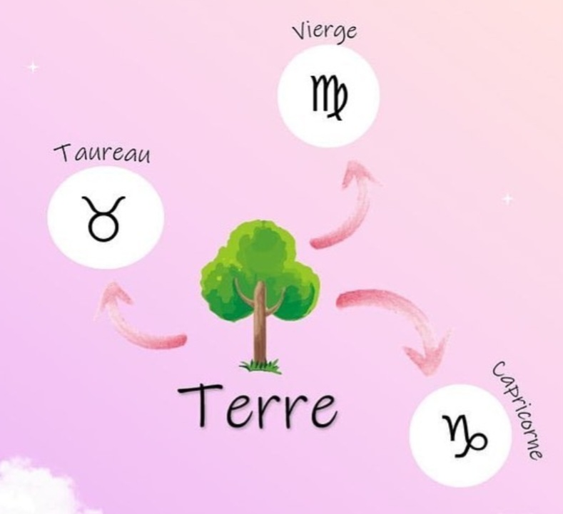

Tactile, grounded and practical, these are the most down-to-earth signs of the zodiac. Reliable and highly productive, they provide a solid foundation to build your success. But they also tend to focus too much on the material and superficial aspects, neglecting what really matters. Earth signs are pragmatic, hardworking and happy to serve. They can be given a job or a mission with peace of mind, even if they tend to get into it without being rushed. They are sensual and creative although the expression of these characters varies according to the sign. Clever and cautious, they need to be reassured on the material and emotional levels. They are very present with their families.

### Air signs (Gemini, Libra, Aquarius)

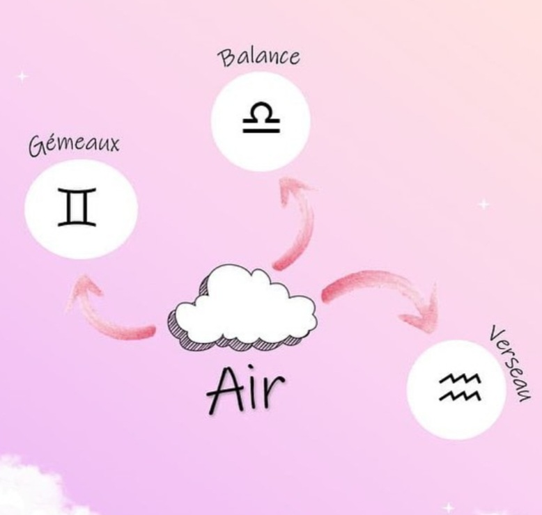

Communication, movement, adventure and inspiration are the key words. Like a breath of fresh air, they can infuse extraordinary energy, insight and vision. However, they may be extremely unpredictable depending on the direction of the wind. You can always count on an air sign to provide the answer to a situation. It is not, however, if he is asked to do something that he does not understand. Air signs are excellent communicators. They thrive in areas that invite them to connect with others, to create connections between groups of individuals. They generally like modern technology. They are active and often nervous. They need to travel, play a sport or have an outlet hobby such as gardening. Air sign likes to flirt, but it does not prevent it from flourishing in its love relationship.

### Water signs (Cancer, Scorpio, Pisces)

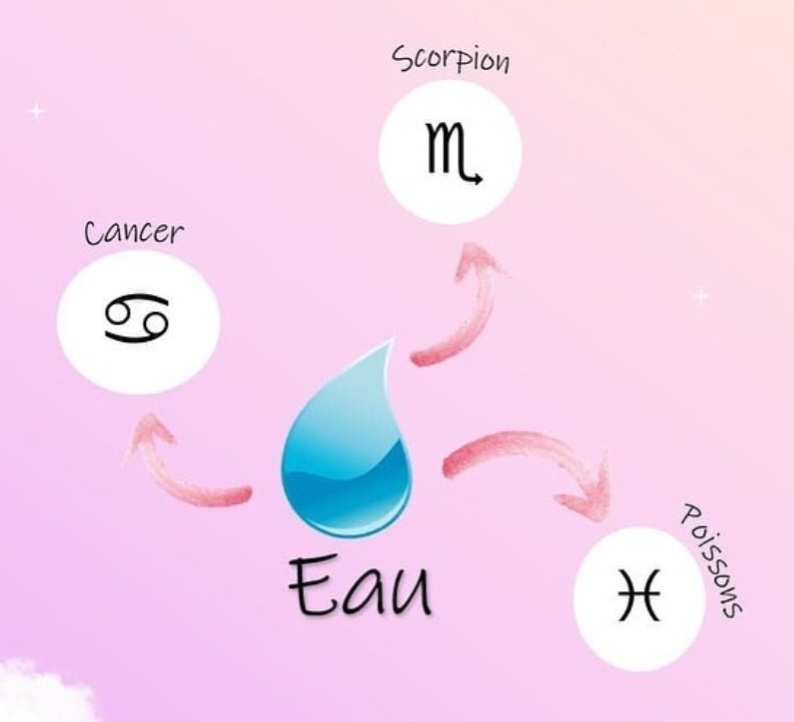

Intuitive, intense and emotional, water signs are often mysterious and luminous. They can adapt to any situation with skill and grace. However, their emotional intensity can turn into possessiveness and paranoia if not balanced. Water signs are deep, sometimes very sensitive individuals. Those who live next to them will discover their duality: on the one hand, joy and exaltation; on the other, passages marked by fear, an emotion intrinsic to the sign of water. These are people who approach things indirectly, preferring to measure a situation before engaging in it. They are intuitive and feel everything that defines the atmosphere around them. Water signs are deeply attached to the people they love, especially their children. Most of them love pets.

[Home](index.md) | [Astr'history](histoireastrologie.md) | [Star Signs](signesastrologiques.md) | [Astral Chart](thèmeastral.md) | [Contacts](contacts.md) | [Site in french](../fr/signesastrologiques.md)
