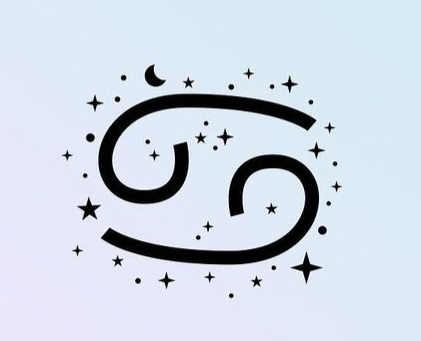
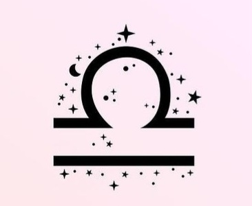
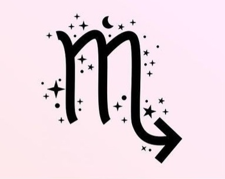
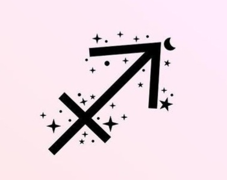
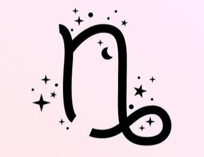
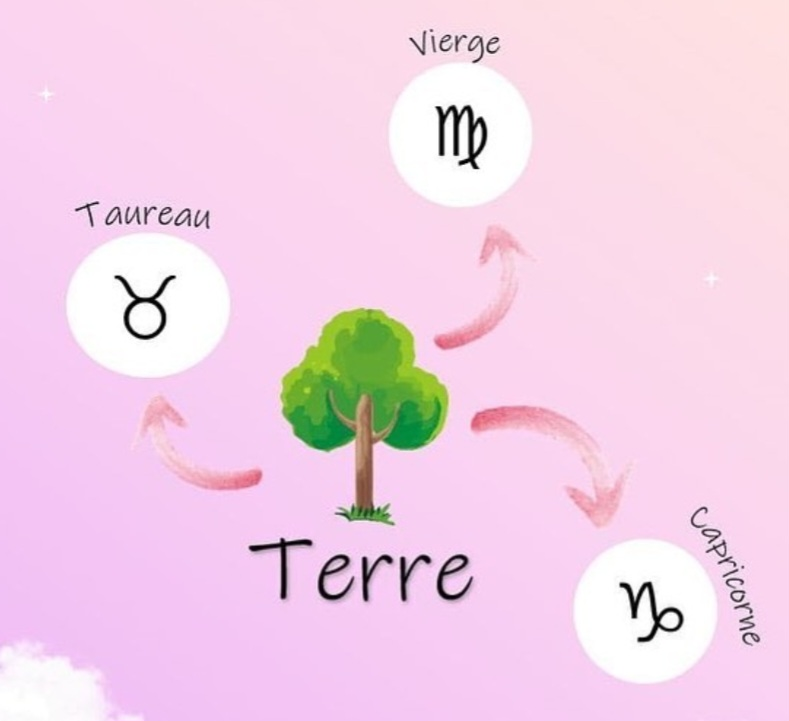

# 
*Les signes astros*

En astrologie, l'année zodiacale ne suit pas le calendrier, mais les saisons. Elle commence donc à l'équinoxe du printemps le 21 mars. Avant de lister les différents signes astrologiques, il est important de faire quelques précisions:

* Chaque signe possède une ou plusieurs planètes dominantes.
* Les signes sont répartis en quatres catégories, les signes de feu, d'eau, d'air et de terre.
* Chaque éléments comprend trois signes.

## **Les signes**

### Le Bélier (21 mars-19 avril)

Le Bélier est un signe de feu dominé par la planète Mars. Le Bélier est le premier signe du zodiaque. Il est associé à la naissance de l'Empire romain et à celle du printemps. C'est un signe de feu masculin, ce qui signifie que le Bélier se déplace ou décide rapidement lorsque c'est son intention. C'est aussi un signe cardinal, ce qui le rend difficile à influencer ou à bousculer dans ses habitudes. Il a la capacité de donner naissance à ce qu'il souhaite mais ses plans peuvent parfois se retourner contre lui. Il est vif d'esprit et peut agir avec fugacité. Souvent intelligent, il n'a pas de temps à perdre avec ceux qui risquent de lui en faire perdre ou avec ceux qu'il considère plus lents que lui.

Le Bélier est courageux, ambitieux. Il n'hésite pas à prendre des risques pour atteindre ses objectifs. Son dynamisme peut en déconcerter plus d'un, bien que cette qualité s'exprime davantage dans le cadre professionnel que dans la vie privée. Il préfère les métiers qui ont du sens et qui sont utiles pour la société. On le retrouve souvent dans les grandes organisations, comme les écoles, les hôpitaux, l'armée ou l'univers de la justice. Dans la vie privée, le Bélier est généralement aimant et respectueux de sa famille. Dans la majorité des cas, il préfère la stabilité du couple, même s'il devra lutter contre une nature impulsive qui peut l'empêcher de rester avec un seul et même partenaire.

Le Bélier est casanier, sa maison est son repère. Il aime la décorer et l'entretenir. Dans ce registre, il aura tendance à imposer son point de vue à ses partenaires. Le Bélier apprécie la loyauté, il demande donc à ses relations de lui être fidèle. Il soutiendra son partenaire si celui-ci traverse un moment de doute. L'impatience et l'impétuosité appuyées par un tempérament bouillonnant constituent le revers de la médaille.

Dans le domaine des finances, le Bélier peut être naïf et dépensier. Il pourra avoir tendance à acheter plus que ce dont il a réellement besoin, sans avoir de soin particulier à l'égard de ce qu'il achète. Le Bélier aime les voitures de sport et ne regarde pas à la dépense lorsqu'il en est question. L'égoïsme et le manque de bon sens constituent les travers du signe. Il n'est pas toujours exigeant et s'impatiente rapidement sauf s'il s'agit d'un sujet qui l'intéresse.

Le courage, la force de caractère, l'intelligence, la loyauté et l'humour constituent les grandes qualités du Bélier. Il est sociable, généreux et a bon esprit. Son idéalisme le conduit souvent en politique ou à ceuvrer pour la société. Il est bienveillant, généreux et attentionné. Il est idéaliste donc et se battra pour protéger les droits des autres. La politique locale ou nationale peut constituer son terrain de prédilection.

Le Bélier pourra se sacrifier si c'est pour le bonheur de ses enfants. Il considère l'éducation comme une clé de voûte du succès. Il n'est pas du genre à se plaindre ou à råler, se bonifie avec l'âge, parce qu'il est persévérant et n'oublie jamais son sens de l'humour au fil du temps qui passe. Il est fidèle en amour tant que ce sentiment est vif. S'il s'estompe, il aura tendance à regarder ailleurs. Le Bélier est souvent artiste, avec une prédilection pour les arts graphiques. Il peut aussi briller dans la mécanique ou l'ingénierie. On le retrouve souvent développeur de logiciel, domaine dans lequel il peut révéler ses talents d'innovateur.

### Le Taureau (20 avril-20 mai)

Le Taureau est un signe de terre dominé par la planète Vénus. Le Taureau est un signe de terre féminin. Par nature, il est minutieux, sensible et capable. Il peut réaliser beaucoup de choses, à condition qu'on lui permette de le faire à son propre rythme. C'est un signe fixe. La combinaison de la terre et de la fixité en fait le signe le plus obstiné du zodiaque. Le Taureau est loyal, fiable, invariable et stable. Il a du mal à gérer les situations qui l'obligent à faire preuve d'adaptation. Le Taureau a le sens pratique, il est persévérant et solide.

Il aime l'argent et le confort, ce qui peut le rendre matérialiste. Il est fait pour les carrières pratiques qui présentent peu de surprises mais qui lui offrent un revenu confortable. Sa fibre artistique est très développée. Il peut l'exprimer dans son travail, ses hobbies ou n'importe quelle activité qui suscite son intérêt. Le Taureau est sociable. Il se fait facilement des amis avec qui il adore sortir. Son sens de l'humour et son caractère affable en font l'invité idéal de n'importe quel événement. Il s'intéresse à de nombreux sujets et a tendance à approfondir les thématiques qui éveillent son intérêt.

Le Taureau craint la pauvreté. Son sens de la responsabilité est aigu. Il sera toujours à la recherche d'un emploi stable qui lui offre un revenu suffisant pour lui et sa famille. S'il peut être ambitieux, il peut surtout se satisfaire d'une position stable et confortable. Le Taureau peut dépenser sans trop compter lorsqu'il est question de voyages ou de hobbies. Dans les temps plus difficiles, il sait faire attention et ne dépense pas à tort et à travers. La vie de famille du Taureau est fondamentale. Il se montre généreux à l'égard de ses êtres chers. Le Taureau est généralement un membre de la famille sur lequel on peut compter. Il se soucie toujours de ses proches, même si son obstination peut le conduire à être trop insistant. Il ne porte pas de jugement sur les défauts des autres et sait être de bon conseil.

Le Taureau a tendance à être obstiné lorsqu'un sujet l'intéresse. À l'excès, cette tendance peut le rendre fatigant pour son entourage. Mais son bon sens naturel lui évite souvent d'en arriver là. Le Taureau a un sens aigu de la beauté, il sera souvent créatif ou artiste. Il est attiré par la mode, la décoration, le maquillage et la coiffure. Autant de sujets qui le conduisent au monde de la mode et du show-business. Ce signe est associé à la voix et à la musique. Le Taureau aime chanter et on le retrouve dans des chorales ou à jouer et à chanter dans des groupes, simplement pour le plaisir. On le retrouve aussi comme hypnothérapeute, une profession qui met en avant la voix comme outil de travail. Il est souvent doué en cuisine.

Le Taureau est courageux. Parmi ses qualités, on retrouve le bon sens, la loyauté, l'esprit de responsabilité et un contact agréable à l'égard des autres. Le Taureau est plus brillant que ce que l'on croit. On aura du mal à prendre le dessus sur lui dans la discussion, parce qu'il sait généralement de quoi il parle. Le Taureau est un véritable ami et un collègue fiable.

### Le Gémeaux (21 mai-21 juin)

Le Gémeaux est un signe d'air dominé par la planète Mercure. Le Gémeaux est signe à l'esprit vif et doué d'une belle intelligence. Sa connexion avec Mercure, le dieu Romain qui endossait le rôle de messager, lui offre des talents innés de communication. Le Gémeaux est sympathique et sociable. Son aspect mutable lui permet de s'adapter facilement au changement. Il peut être à l'aise avec les chiffres, ce qui le conduit vers des carrières dans la banque, la comptabilité ou les statistiques. Le Gémeaux se met vite au travail, il est doué pour la réflexion intellectuelle et l'organisation. C'est un signe davantage orienté vers le mental que vers les émotions, son esprit est rarement oisif. Il peut être difficile en négociation et montre de véritables compétences pour faire des affaires. Il doit apprendre à contrôler son impulsivité naturelle ainsi que sa tendance à intimider ceux qui ne sont pas en mesure de lui tenir tête.

On accuse souvent le Gémeaux de ne pas savoir s'accrocher longtemps à quelque chose et d'avoir une connaissance superficielle des sujets qu'il dit maitriser. Mais ces jugements sont infondés, le Gémeaux fait en réalité preuve de détermination lorsqu'il est question d'un sujet qui l'intéresse. Il sait alors lui consacrer une étude approfondie. Il peut être un travailleur acharné qui ne compte ni sa peine ni ses heures. Il peut être d'un naturel inquiet et il n'est pas rare qu'il s'énerve pour des choses jugées sans intérêt par les autres. Il peut ressentir de l'insécurité dans sa carrière professionnelle ou sa vie privée même si tout semble bien se passer. Il aura donc tendance à avoir besoin d'être rassuré, sans que son entourage ne le sache vraiment. Il peut arriver que le Gémeaux soit privé d'amour, de sécurité ou d'attention, ou souffre de carences matérielles durant l'enfance. Le Gémeaux consacrera son énergie à trouver un moyen pour gagner sa vie et la bonne personne à aimer. C'est un processus qui peut prendre du temps.

Le Gémeaux peut se montrer tranchant, parfois au point de faire voler en éclat une relation pourtant viable. Il peut être porté sur l'alcool. Il peut avoir tendance à la consommation excessive, surtout en matière de vêtements et d'accessoires. Comme il est d'un naturel à conserver ses affaires, les armoires du Gémeaux risquent vite de déborder.

Le Gémeaux fera ce qu'il faut pour que sa relation s'inscrive dans la durée. Cependant, si son couple échoue, il ne tardera pas à se mettre en quête d'une nouvelle relation. Le Gémeaux se mettra en quatre pour que sa famille ne manque de rien, que ses enfants reçoivent une bonne éducation et puissent prendre un bon départ dans la vie. Il lit et apprend toute sa vie et son champ de connaissance est étendu. Le Gémeaux est souvent talentueux. C'est un être au grand cœur qui n'hésite pas à aider son prochain. Sa faiblesse émotionnelle le conduit cependant à perdre rapidement patience avec les canards boiteux. Sa vie sociale est généralement riche. Il est toujours partant et on passe du bon temps avec lui. Le Gémeaux est un signe mutable, on le voit changer régulièrement de travail et passer de projet en projet.

### Le Cancer (22 juin-22 juillet)

Le Cancer est un signe d'eau dominé par la Lune. Le Cancer est régi par la Lune, ce qui en fait un signe sensible et émotif. C'est un signe d'eau féminin, il est donc très intuitif, d'une nature attentionnée et exprime le besoin d'aider les autres et de protéger sa famille. Le fait qu'il s'agisse d'un signe cardinal constitue le revers de la médaille. Le Cancer est difficilement influençable. Il est aussi beaucoup plus dur que ce que l'on pourrait croire.

Le Cancer est timide lorsqu'il est jeune. S'il parvient à régler ce problème en vieillissant, il évitera tout de même d'être sous les feux de la rampe. Le Cancer a la réputation d'être casanier, mais cela ne l'empêche pas d'avoir l'âme voyageuse. On le retrouve souvent dans des postes qui réclament une certaine mobilité et qui conduisent à rencontrer de nombreuses personnes au cours d'une même journée.

Le Cancer tend à s'émanciper rapidement. Il peut être amené à assumer des responsabilités dès le plus jeune âge, surtout lorsqu'il est l'aîné d'une famille nombreuse. Il continuera alors à prendre une attitude responsable à l'égard de ses proches même si ces derniers ont atteint l'âge adule. La famille est un pilier du Cancer. La relation qu'il entretient avec sa mère est généralement très intense, au point d'en rester très proche ou de se brouiller avec elle. Dans la plupart des cas, le Cancer prend soin de ses enfants et de ses proches. Il cuisine bien et arrange la maison pour qu'elle soit un nid douillet. Le Cancer est astucieux et se débrouille bien dans le monde des affaires.

C'est un signe au contact facile avec le public. On le retrouve souvent dans des carrières qui le confrontent avec des gens, un magasin par exemple, ou un restaurant. Le Cancer travaille fréquemment dans la vente, surtout lorsqu'elle est liée à l'habitat. On le trouve aussi dans le monde des finances, de l'immobilier, ou de l'assurance. Il aime aider les autres à acheter ou assurer leur maison.

Il n'est pas rare de rencontrer des Cancer dans le monde de l'enseignement ou dans des professions liées à la santé. C'est un signe qui aime l'histoire. Sa mémoire est excellente. Il fait preuve d'une vraie qualité d'écoute et d'un talent indubitable pour désamorcer les conflits. C'est un conseiller né. S'il peut supporter le bruit, le chaos et les disputes dans le cadre professionnel, à la maison il a besoin de calme et de tranquillité. Lorsqu'il est face à des difficultés, le Cancer peut se renfermer sur lui-même, ne facilitant pas le travail de ceux qui l'entourent à l'heure de lui venir en aide. Il peut être d'un naturel inquiet à l'égard de sa famille et parfois de l'argent. S'il donne une impression de douceur, le Cancer n'est pas du genre à se laisser influencer. Il peut être paresseux et attendre des autres qu'ils s'occupent de lui.

Un Cancer ne restera pas avec un partenaire qui le traite mal. Il essaiera malgré tout de rester en contact avec les membres de sa famille, même après une séparation, tant que cela se fait dans le respect. L'un des revers du Cancer est d'avoir tendance à blesser ceux qu'il perçoit comme faible. Il n'est pas rare qu'il ait un comportement dur à l'égard de ses gendres et brus. Et puis, il arrive que le Cancer se comporte curieusement face à l'argent. Fort heureusement, c'est un signe qui fait souvent preuve de bon sens. Il sait être raisonnable à l'égard des autres et des questions financières. Cependant, sa nature versatile et sa tendance à prendre des décisions du point de vue émotionnel peuvent lui jouer des tours.

### Le Lion (23 juillet-22 août)

Le Lion est un signe de feu dominé par le Soleil. Le Lion est un signe de feu masculin. Il sait mettre les moyens pour obtenir ce qu'il souhaite. Le Lion a un esprit logique et organisé. En tant que signe fixe, il ne change pas facilement de direction et fait tout ce qui est en son pouvoir pour maintenir le statu quo.

Le Lion est doué par nature, à tel point qu'il peut être agacé par ceux qui n'ont pas la même efficacité. Il ne comprend pas que l'on puisse laisser passer des opportunités. Ce sont parfois les premières difficultés de la vie qui rendent le Lion ambitieux et autonome. Il est attiré par les professions prestigieuses, notamment dans l'industrie aéronautique ou le spectacle, la banque, l'édition, ou le tourisme. On le retrouve fréquemment dans les branches commerciales ou administratives de ces domaines. Il n'est pas rare de le voir à la tête de sa propre entreprise, il est en effet du genre à gérer sa barque. Le Lion aime la musique et souvent, il joue d'un instrument, il chante ou il danse. Il est fréquent de le voir sur les planches, sous les projecteurs. S'exprimer en public ne l'effraie pas le moins du monde. Il est à l'aise avec les technologies de communication.

Le Lion n'est pas toujours glamour ou charismatique, il ne rencontre pas non plus le succès systématiquement. Il dépense alors une énergie considérable pour que ses enfants aillent aussi loin que possible dans la vie. Le Lion a tendance à se marier et à fonder une famille lorsqu'il est jeune. Ses enfants occuperont alors rapidement le centre de son univers. Le Lion est un personnage affectueux doué en amour et brillant lorsqu'il devient parent. L'honnêteté, la décence, la loyauté et la générosité définissent le Lion qui peut aussi être arrogant et déplaisant. Il est souvent animé par de bonnes valeurs morales.

Le Lion peut se donner des airs grandioses, il peut être chargé de grandes responsabilités et demander à être traité avec le plus grand des respects. Mais c'est avant tout un individu qui aime par-dessus tout offrir et recevoir de l'affection. Dans des circonstances normales, il est chaleureux, généreux, sociable et populaire. Il lui arrive aussi d'être lunatique et irritable lorsqu'il se sent sous pression ou qu'il n'est pas en forme. Le Lion se jette corps et âme dans tout ce qu'il entreprend. Il peut travailler comme un titan mais peut aussi plier sous le poids de la fatigue lorsqu'elle lui tombe dessus. Le Lion a régulièrement besoin de vacances pour recharger ses batteries. Il donne l'image de quelqu'un qui est sûr de lui et à qui tout réussit. Mais cette confiance peut rapidement s'effacer. Le Lion est d'une grande sensibilité, il est susceptible et ne supporte pas qu'on se moque de lui. S'il est d'un naturel casanier et plutôt doué en cuisine, il aime aussi sortir et partager un dîner entre amis, accompagné d'un bon verre de vin.

Il peut avoir des dépenses luxueuses bien au-dessus de ses moyens. Il aime occuper une place importante dans la société et apprécie le style de vie conféré par le succès. Le Lion est fier et place toujours la barre très haut dans tout ce qu'il fait. Il est souvent honnête et intègre. Mais le Lion peut être snob et méprisant.L'arrogance qui le caractérise peut même devenir insupportable.

En amour, le Lion est loyal et se mettra en quatre pour son partenaire. La nature fixe de ce signe favorise les relations au long cours, mais il ira voir ailleurs si son ou sa partenaire ne l'aime pas d'un amour sincère et véritable. Le Lion peut être très rancunier.

### La Vierge (23 août-22 septembre)

La Vierge est un signe de terre dominé par la planète Mercure. La Vierge est parmi les signes les plus travailleurs du zodiaque. Elle aime les tâches minutieuses et ne supporte pas qu'on lui mette la pression. On la retrouve dans le secteur de la santé, qu'il s'agisse de médecine classique ou de médecine alternative.

Enfant, la Vierge peut rencontrer des difficultés avec l'autorité, avec ses parents ou ses professeurs qui pourront être inutilement sévères ou critiques à son égard. Il est possible que l'enfant Vierge soit entré dans la vie de ses parents à un moment difficile, ou que le fait d'avoir un enfant ait changé leur style de vie au point de créer des tensions dans le foyer. La frustration qui en résulte peut se répercuter sur l'enfant. Une enfance pas franchement heureuse peut conduire la Vierge à quitter ses parents plus tôt que prévu, en s'installant avec son partenaire ou en se mariant. Lorsque cela arrive, la Vierge s'engage alors pour que sa relation fonctionne. Elle peut cependant échouer parce que le couple est trop jeune, parce qu'il rencontre des difficultés économiques ou qu'il manque tout simplement d'expérience.

La Vierge peut chercher d'autres moyens de commencer très tôt sa vie d'adulte, en s'engageant dans l'armée, en faisant du bénévolat à l'étranger, ou en montant sur les planches, par exemple. Ce n'est d'ailleurs pas une mauvaise idée, il suffit en effet de constater le nombre de Vierge dans le monde du spectacle, pour s'en convaincre. La Vierge qui a fait des études, mène souvent une carrière dans le monde de la communication, de l'édition et des médias. Il arrive que ce signe ait du talent pour chanter. Le plus souvent elle est mélomane. En tant que signe de terre, son pan émotionnel est très puissant, ce qui lui permet de s'évader en écoutant de la musique ou en lisant un livre.

La Vierge prend ses responsabilités au sérieux. Lorsqu'elle s'engage dans une relation, sa famille peut compter sur elle pour la soutenir. Il arrive parfois que la Vierge s'engage si fortement dans son travail qu'elle en oublie son partenaire et ses enfants. Si elle se retrouve avec un partenaire difficile, exigeant, arriviste ou usant, elle préférera le quitter plutôt que de vivre une relation tumultueuse. Elle aime les petits animaux, et il n'est pas rare qu'elle ait un chat, un chien ou encore un lapin. Elle est incapable de les abandonner.

L'esprit de la Vierge est plutôt académique, ce qui ne l'empêche pas de s'amuser, de profiter des vacances et de prendre du temps libre pour faire des choses qui l'intéressent. Son sens de l'humour et sa fiabilité, ainsi que son bon cœur, font de la Vierge un partenaire merveilleux dans la relation amicale. Sa capacité d'écoute et son empathie en fait un conseiller de premier plan. Malgré son bon fonctionnement intellectuel, la Vierge perd ses moyens lorsqu'on lui met la pression. Les signes de terre sont toujours plus à l'aise lorsqu'on leur laisse le temps de réfléchir et de faire les choses à leur rythme. Dans la précipitation, ils font souvent des erreurs d'appréciation.

La Vierge peut être d'un naturel inquiet, ce qui la rend difficile à supporter lorsque cette tendance est poussée à l'extrême. La Vierge est perfectionniste et peut être critique à l'égard des autres ou d'elle-même. Bien qu'ambitieuse, lorsqu'elle est face à un succès potentiel, il lui arrive de gâcher ses chances d'y arriver.

### La Balance (23 septembre-22 octobre)

La Balance est un signe d'air dominé par la planète Vénus, tout comme le Taureau. D'un point de vue technique, la Balance est un signe déroutant. D'une part, c'est le seul signe représenté par un symbole inanimé et d'autre part, c'est un signe masculin qui est gouverné par Vénus, une planète hautement féminine. Elle appartient à l'élément air, ce qui la rend froide et détachée, logique plutôt que portée sur les émotions. Ces caractéristiques sont modérées par la qualité cardinale du signe. Avec cet étrange mélange de passivité/agressivité, doit-on vraiment s'étonner de constater que la Balance est terriblement indécise ?

La Balance est un signe qui maîtrise le tact et la diplomatie. Elle est amicale avec tous ceux qui s'approchent d'elle. Son air détaché et introspectif rend pourtant difficile sa lecture. Certaines Balance passent leur vie à chercher le partenaire idéal. D'autres sont tellement indépendantes qu'après avoir essayé quelques relations, elles décident de rester seules et de faire les choses à leur manière. La Balance aime flirter, ce qui est plutôt flatteur et agréable tant que personne ne se prend trop au sérieux.

La personnalité de la Balance est douce et plaisante. Elle peut exercer une profession dans laquelle la forme compte tout autant que le fond. Elle fera un dentiste, un avocat ou un comptable sympathique qui verra le nombre de ses clients augmenter, tant pour son altruisme que pour ses compétences. Elle aime réunir les gens et régler les problèmes dans la douceur. On la retrouve donc dans des professions d'arbitrage, et de négociation. Elle est fine d'esprit et douée de ses mains. On la verra souvent styliste, ingénieur ou encore dans un métier de l'industrie cosmétique. Elle est aussi très présente dans le monde de la musique et dans celui de la danse. Le droit est également un univers de prédilection pour la Balance. Son désir permanent de trouver un accord entre les gens et sa haine de l'injustice en font un juriste de premier plan.

Ce qui est sûr c'est que la Balance cherchera toujours une profession qui permet de bien gagner sa vie. Elle aspire en effet à un niveau de vie élevé. Elle est généreuse à l'égard des personnes qu'elle aime, elle s'assurera que son partenaire ne manque de rien, ce qui ne l'empêchera pas de souhaiter son indépendance financière. La Balance aime les tâches ménagères et il n'est pas rare qu'elle soit douée en cuisine ou qu'elle cultive ses fruits et légumes.

C'est un signe cardinal. La Balance a une forme de rigidité liée au fait qu'elle observe les règles et se réfère à un monde de codes et de conventions. Elle cherche les compromis et les accords dans ce cadre et peut être intransigeante avec les pulsions qui n'entrent pas dans le périmètre. Puisque la Balance n'aime pas spécialement se retrouver face à elle-même, elle cherche à avoir des partenaires, des amis et des collègues. Elle n'aura pas de mal à créer un tissu de relations, parmi lesquelles peu seront véritablement proches d'elle. La Balance peut être d'une compagnie délicieuse, mais lorsqu'elle est de mauvaise humeur, elle peut être profondément déplaisante et n'hésitera pas à dire ce qu'elle ressent ou à blesser pour le plaisir. La Balance est réellement un signe tout à fait déroutant, partagé entre ce qu'elle a de bon et ce qu'elle a de moins bon.

### Le Scorpion (23 octobre-21 novembre)

Le Scorpion est un signe d'eau dominé par les planètes Mars et Pluton, bien que cette dernière soit officiellement considérée comme une planète naine/mineure et n'appartenant plus au système solaire. Voici un autre signe très déroutant. C'est un signe d'eau féminin que l'on pourrait penser doux et faible alors que le Scorpion n'est pas loin du contraire. Le fait qu'il s'agisse d'un signe d'eau implique que le Scorpion prend ses décisions selon son ressenti. Avec lui, ce qui est valable un jour, ne l'est pas nécessairement le lendemain. C'est un signe d'une extrême sensibilité, qui a tendance à être facilement heurté ou blessé. Le Scorpion se donne beaucoup de mal pour dissimuler ses faiblesses et sa vulnérabilité, afin d'éviter que les autres n'en profitent.

C'est un signe passionné, de type " tout ou rien", qui peut pousser les situations à l'extrême. Par exemple, le Scorpion peut être abstinent ou très porté sur l'alcool; il peut être très économe ou dépensier frénétique; il peut être généreux par certains aspects et égoïste par d'autres. C'est un signe qui saura se montrer gentil et serviable ou tout son contraire. Tout dépend de son humeur. Personne n'est plus charmant et hospitalier quand le Scorpion veut de la compagnie. Mais si ce n'est pas le cas, il saura l'exprimer sans équivoque possible.

Le Scorpion est très persuasif, ce qui en fait un excellent vendeur ou un très bon conseiller. À l'extrême, il peut être manipulateur ou jouer la carte de l'intimidation. On le retrouve dans les métiers de la santé, en tant que médecin ou guérisseur. Le Scorpion est très intuitif, il lit les gens mieux que personne. Il fera un excellent psychologue, un thérapeute intuitif. Certains trouvent leur voie dans les forces armées. Le Scorpion prend son travail très au sérieux et travaille souvent très dur pour obtenir le respect et l'approbation des autres. Du fait de son manque de confiance en lui, le Scorpion aime détenir le pouvoir dans l'ombre du trône. On trouve beaucoup de Scorpion dans la finance, souvent à des postes de conseiller en crédit, en assurance, en placements, etc. On le retrouvera également dans le droit spécialisé dans les testaments et les fonds fiduciaires.

La voix du Scorpion est l'une de ses principales qualités. Souvent d'une tessiture qui tend vers les basses, agréablement modulée et travaillée, le Scorpion s'en sert pour convaincre. Contrairement à ce que de nombreux livres d'astrologie racontent, le Scorpion n'est pas exagérément porté sur le sexe, pas plus qu'il n'est insupportable. C'est un signe sous la lumière de la passion qui aime qu'on le trouve attirant. Le Scorpion aime choquer et s'amusera à taquiner, mais c'est surtout un ami fidèle et un hôte de premier choix.

Certains Scorpion aiment les animaux et s'en occupent mieux que personne. D'autres auront une formidable fibre avec les enfants. La plupart aiment la vie de famille surtout lorsqu'elle est animée par les enfants et les petits-enfants.

### Le Sagittaire (22 novembre-21 décembre)

Le Sagittaire est un signe de feu dominé par la planète Jupiter. Le Sagittaire est un signe de feu masculin qui a tendance à penser et réagir rapidement. Il peut avoir une bonne vision d'ensemble d'une situation mais exprimer des difficultés à envisager les détails. C'est un signe mutable, il est donc enclin à s'adapter et à se fondre facilement à un nouvel environnement. Le Sagittaire pourra être amené à changer de région, voire de pays plusieurs fois dans sa vie.

Le Sagittaire peut avoir deux natures bien distinctes. Il peut être discret, timide, témoignant un certain manque de confiance en lui et heureux uniquement lorsqu'il est avec sa famille ou ses amis proches. Mais il peut aussi être plus extraverti que n'importe quel autre signe du zodiaque. Le Sagittaire est travailleur. Il peut avoir du succès dans sa carrière, mais son manque de confiance en lui ou bien des décisions hasardeuses peuvent le faire chuter ou l'empêcher d'exploiter tout son potentiel. Le Sagittaire est un signe de chance, il retombera sur ses pieds après chaque épreuve. Il peut être attiré par l'astrologie et les activités spirituelles. Son mode de pensée est souvent philosophique, mais il aura tendance à s'éloigner de la religion de ses parents ou des personnes qui l'ont éduqué. Il peut donner l'impression d'être superficiel alors qu'il n'en est rien. Le Sagittaire est un penseur du genre studieux.

Le Sagittaire est actif, il a du mal à rester en place trop longtemps. Il aime le mouvement et ne supporte pas d'être attaché à un endroit en particulier, surtout dans le cadre de son travail. Le Sagittaire aura tendance à choisir un métier qui lui permet d'être en contact avec de nombreuses personnes. Cela peut être une profession qui le conduit à se déplacer, ou bien un passe-temps qui l'encourage à sortir et rencontrer du monde. Contrairement à ce qu'il donne à voir, le Sagittaire, comme tous les signes de feu, se fatigue facilement et a besoin d'un temps de repos pour recharger ses batteries.

Le Sagittaire peut être prêtre, enseignant, commerçant, électricien, menuisier, agent de voyages, chauffeur de bus ou de taxi, tailleur, etc. Il est à l'aise dans les métiers en contact avec le public. Vétérinaire, dresseur de faucons ou encore instructeur dans l'armée de l'air sont des professions qui peuvent aussi lui plaire. On le retrouve astrologue, voyant, cartomancien ou chiromancien. Le Sagittaire est habile de ses mains. Il aime construire et rénover. Il aime être à l'extérieur, voyager et explorer les environs. Quand il est jeune, le Sagittaire apprécie les vacances actives dans des lieux divertissants. La plupart aiment également s'occuper des animaux de compagnie.

En amour, le Sagittaire ne supporte ni le harcèlement, ni la privation de liberté. Il a l'injustice en horreur. Son sens de l'honnêteté peut le rendre maladroit et est susceptible de heurter, mais ce n'est jamais intentionnel. L'enfant qui est en lui est bien vivant, ce qui en fait un partenaire de jeu idéal. Si l'enfance du Sagittaire n'a pas été heureuse, il peut être un adulte triste et solitaire. Dans cette situation, l'importance de son partenaire sera déterminante.

### Le Capricorne (22 décembre-19 janvier)

Le Capricorne est un signe de terre dominé par la planète Saturne. Le Capricorne est un signe de terre feminin caractérisé par un sens commun et pratique prononcé. Il prête beaucoup d'attention aux détails. C'est aussi un signe cardinal, ce qui en fait une personne que l'on ne doit pas bousculer ou obliger à faire ce qu'elle n'a pas l'intention de faire. Le Capricorne ne se précipite pas. Il a tendance à obtenir ce qu'il souhaite sur le long terme. Lorsqu'il jette son dévolu sur une personne, il pourra l'attendre une vie entière si c'est le temps nécessaire pour l'obtenir. Il choisit souvent un partenaire plus âgé, parfois même beaucoup plus âgé.

D'une manière ou d'une autre, tous les Capricorne sont ambitieux, pour eux ou pour leurs enfants. Ils veulent la meilleure éducation pour leur progéniture. En étant pratique, sensible, réaliste et responsable, le Capricorne prend la vie très au sérieux, ce qui ne l'empêche pas d'avoir un sens de l'humour prononcé. Certains Capricorne aspirent à rester célibataires, notamment parce qu'ils peuvent être timides ou maladroits avec les choses de l'amour. Mais aussi parce qu'ils auront tendance à rester longtemps avec leurs parents pour s'occuper d'eux. Lorsqu'il s'engage dans une relation, le Capricorne prend la chose très au sérieux et fera tout pour qu'elle fonctionne.

Le Capricorne peut être capricieux et du genre à s'inquiéter pour un rien. Il peut être exagérément susceptible et passablement insupportable avec son attitude irritable. L'ambition du Capricorne peut parfois l'entraîner vers des activités douteuses, même si en général, il est du genre à suivre le droit chemin. Ses choix de carrière peuvent le conduire n'importe où et toutes les professions l'attirent, avec une préférence pour la comptabilité et le monde de la banque. Il n'est pas rare qu'il aspire à posséder son lopin de terre. L'agriculture et l'immobilier peuvent être des terrains d'intérêt pour lui. L'astrologie traditionnelle associe ce signe à toutes les formes de sciences.

Le fait d'être installé entre les deux signes les moins conventionnels du zodiaque (Sagittaire et Verseau) peut légèrement déteindre sur le Capricorne. Il pourra avoir des intérêts et des talents plutôt rares. Il peut être astrologue, chiromancien ou voyant. Le Capricorne est généralement bon danseur. Certains sont experts en antiquités ou collectionneurs de timbres, très bons cuisiniers ou champions de sports peu communs.

Le Capricorne est patient, réaliste et responsable. Il prend la vie au sérieux, il a donc besoin d'une sécurité qu'il n'obtient pas toujours. Il peut passer beaucoup de temps à travailler, simplement pour payer ses factures, mais son ambition et son désir de statut le conduisent d'une manière ou d'une autre à gravir les échelons vers le succès. Lorsqu'il est entrepreneur, le Capricorne a besoin d'un partenaire qui s'occupera des ventes et du marketing. Il peut être pinailleur, ce qui en agace plus d'un. Il peut aussi avoir tendance à savoir tout, mieux que tout le monde. Le Capricorne est fidèle et fiable. Il n'est pas du genre que l'on sème facilement, et se remettra péniblement des relations brisées.

### Le Verseau (20 janvier-18 février)

Le Verseau est un signe d'air dominé par les planètes Saturne et Uranus. Le Verseau est un signe fixe d'air masculin. On pense souvent à tort qu'il s'agit d'un signe d'eau du fait de son symbole, mais c'est bien un signe d'air. Les signes d'air sont souvent plus à l'aise dans le monde des idées que dans celui des émotions. De fait, le Verseau n'est jamais à court d'idées bien qu'il puisse éprouver des difficultés à les mettre en pratique. Il peut passer beaucoup de temps à réfléchir ou à parler de ses idées plutôt que de les réaliser. Inventif, intelligent et souvent ingénieux, le Verseau trouvera plus souvent la solution aux problèmes qu'il rencontre que les autres signes du zodiaque. Il paraît avoir confiance en lui, mais ce n'est parfois qu'une impression. Timide, il s'ouvrira difficilement aux autres de ce manque de confiance.

Les personnes sous ce signe qui incarne la gentillesse et l'humanité travaillent souvent pour le bien des autres. Elles peuvent s'engager dans des causes humanitaires et prendre cette mission tellement à cœur au point d'en négliger leur propre famille. Le Verseau est tête en l'air et souvent en retard, parce qu'il a tendance à tout faire au dernier moment.

Le Verseau aime l'enseignement et fait preuve de la patience nécessaire pour apprendre. Il parle doucement, s'exprime clairement et dispose toujours ses idées dans un ordre logique. On le retrouve souvent dans des professions caractérisées par l'altruisme. Il est généralement attiré par l'informatique. S'il trouve un métier porté sur la technologie et dont le côté humain est prégnant, le Verseau sera là où il doit être. Il a besoin d'une famille mais il aspire aussi à l'indépendance. Un partenaire étouffant ou un enfant très en demande auront tendance à l'asphyxier. Il arrive que le rôle de parent ne l'attire pas et de le voir préférer la compagnie des animaux à celle des enfants, voire des adultes. Le Verseau sera heureux si son partenaire comprend son besoin d'espace ou celui de s'éloigner parfois de son travail, de sa routine et de son foyer. Intelligent, amical, aimable et humain, le Verseau est facile en amitié, même s'il a tendance à ne pas se mettre à nu aisément. Consciencieux, il ne laisse pas sa famille dans le besoin mais pourra être aveugle, parfois même délibérément, aux besoins sous-jacents et aux sentiments de ses enfants ou de ses proches. Il sera plus à l'aise avec des causes et des idéaux qu'avec la routine quotidienne. Dans certains cas, le désordre qui règne chez lui peut refléter ce manque d'intérêt.

Le Verseau peut faire preuve d'une grande originalité dans sa manière de s'habiller ou de vivre, s'attachant à montrer qu'il est différent des autres. Il peut être passionné d'astrologie, de numérologie, d'égyptologie. Il peut aussi offrir une apparence plus conventionnelle, sachant que ses centres d'intérêt ne le sont pas. Son esprit agité et sceptique le conduit à rechercher un mode de vie alternatif. Le Verseau cache une personnalité sous tension par une apparence calme et tranquille. Ses émotions refoulées peuvent parfois exploser et conduire à un comportement irrationnel. Cela étant, le Verseau est extrêmement loyal et fidèle lorsqu'il a trouvé le bon partenaire.

### Le Poissons (19 février-20 mars)

Le Poissons est un signe d'eau dominé par les planètes Jupiter et Neptune. Il s'agit d'un signe d'eau féminin. L'intuition, les sentiments et les émotions sont au coeur de ses décisions et de ses actions. Le fait qu'il soit mutable conduit le Poissons à s'adapter mieux que quiconque aux changements de circonstances. C'est une vraie qualité pour le Poissons dont la vie aura fréquemment une tendance chaotique, même s'il ne s'agit que d'un secteur de son existence. Le Poissons pourra par exemple avoir une vie professionnelle pleinement satisfaisante mais une vie familiale très compliquée.

Les premières années du Poissons sont souvent difficiles, avec des parents qui auront tendance à le délaisser. Il quittera prématurément le foyer parental pour commencer sa vie d'adulte en s'investissant dans une relation amoureuse par exemple (souvent avec un autre Poissons). La relation ne dure pas longtemps mais laisse place à une belle amitié avec son ex, dont il pourra s'occuper si besoin est. La plupart des Poissons sont attachés à leur famille et sont de bons parents et de bons grands-parents. Les proches du Poissons peuvent même abuser de leur bonté. Il ne se fait pas prier pour aider les autres, se chargeant même de responsabilités qui ne sont pas les siennes. Le Poissons ne supporte pas de voir les autres souffrir et s'empressera de leur venir en aide. Attention tout de même à ce que cette assistance ne leur soit pas préjudiciable.

Le Poissons peut avoir beaucoup de succès dans les affaires, notamment lorsqu'il travaille dans le commerce ou le marketing. Il comprend facilement les besoins des gens et sa nature agréable, qui n'est pas dans le jugement, lui permet de faire passer ses idées d'une manière enviée par beaucoup. Il gagne de l'argent en s'assurant que sa société propose les bons produits ou les bons services à ses clients. Le Poissons a toujours beaucoup de contacts, qui s'avéreront utiles lorsqu'il souhaitera élargir son horizon.

Le Poissons est créatif, ce qui le conduit à l'écriture, la musique, les arts ou le monde de la mode. Il adore réparer les objets usagés. Avec des valeurs plus spirituelles que matérielles, le Poissons est rarement fortuné, mais il fait en sorte de ne manquer de rien. Il n'est pas rare qu'il se sente en insécurité et la plupart connaissent la pauvreté à un moment donné de leur vie. Le Poissons est extrêmement intuitif et on le retrouve souvent dans la spiritualité, la clairvoyance, l'astrologie, le tarot, etc.

Le Poissons est du genre voyageur. Il peut avoir plusieurs lieux de vie en même temps, aimer la vie en camping-car ou vivre en mobile-home. Il aime la mer et possède souvent un bateau. Le Poissons peut être têtu, maladroit et plutôt méchant lorsque les choses tournent mal, mais il est rarement vindicatif. Il préfère aider plutôt que blesser les autres. Il aime généralement les animaux. Il a souvent un animal de compagnie et travaillera volontiers à leur profit.

Sa tendance à trop boire est un aspect négatif du signe, surtout lorsqu'il est en société ou que la vie est difficile avec lui. Il arrive qu'il en tombe malade. Sa capacité à suivre le courant lui est salvatrice, de même que sa tendance naturelle à voir le côté humoristique des choses, même lorsque les temps sont durs. Le Poissons est une compagnie agréable et un bon ami, même s'il a tendance à sortir rapidement de la vie des gens lorsqu'il en ressent le besoin.

## **Les éléments**

Nous avons parlé de chaque signe astrologique, mais qu'en est-il des éléments et quelles informations complémentaires apportent-ils ?

### Les signes de feu (Bélier, Lion, Sagittaire)

Passion, spontanéité et motivation sont ici les mots-clés. Comme l'élément même, les signes afférents insufflent chaleur et lumière. Ils peuvent s'épuiser rapidement ou provoquer une immense destruction si leur enthousiasme débordant n'est pas bien géré. Les signes de feu sont généralement rapides et efficaces, ils ne perdent pas leur temps dans des futilités et n'hésitent pas à foncer tête baissée. Ils ont du mal à comprendre pourquoi les autres signes n'ont pas systématiquement tendance à en faire autant lorsque l'opportunité se présente. Les signes de feu sont rapides, intelligents et généreux. Ils aiment profondément et passionnément. Ils sont plus sensibles que ce qu'ils nous donnent à voir et peuvent être blessés lorsqu'ils considèrent ne pas recevoir autant que ce qu'ils donnent.

### Les signes de terre (Taureau, Vierge, Capricorne)

Tactiles, ancrés et pratiques, ce sont les signes les plus terre à terre du zodiaque. Fiables et très productifs, ils fournissent des bases solides sur lesquelles bâtir votre succès. Mais ils ont aussi tendance à trop se focaliser sur les aspects matériels et superficiels, négligeant ce qui compte vraiment. Les signes de terre sont pragmatiques, travailleurs et heureux de rendre service. On peut leur confier un travail ou une mission en toute tranquillité, même s'ils ont tendance à s'y mettre sans se brusquer. Ils sont sensuels et créatifs bien que l'expression de ces caractères varie en fonction du signe. Astucieux et prudents, ils ont besoin d'être rassurés sur les plans matériel et émotionnel. Ils sont très présents auprès de leur famille.

### Les signes d'air (Gémeau, Balance, Verseau)

Communication, mouvement, aventure et inspiration sont les mots-clés. Comme une bouffée d'air frais, ils peuvent insuffler une énergie, un discernement et une vision extraordinaires. Néanmoins, ils risquent d'être extrêmement imprévisibles, selon la direction du vent. On peut toujours compter sur un signe d'air pour apporter la réponse à une situation. Ce n'est pas le cas, par contre, si on lui demande de faire quelque chose qu'il ne comprend pas. Les signes d'air sont d'excellents communicants. Ils s'épanouissent dans des domaines qui les invitent à tisser des liens avec les autres, à créer des connexions entre des groupes d'individus. Ils aiment généralement la technologie moderne. Ils sont actifs et souvent nerveux. Ils ont besoin de voyager, de pratiquer un sport ou un passe-temps pratique qui leur sert d'exutoire, comme le jardinage. Le signe d'air aime flirter ce qui ne l'empêche pas de s'épanouir dans le cadre de sa relation amoureuse.

### Les signes d'eau (Cancer, Scorpion, Poissons)

Intuitifs, intenses et émotifs, les signes d'Eau sont souvent mystérieux et lumineux. Ils peuvent s'adapter à toute situation avec habileté et grâce. Toutefois, leur intensité émotionnelle peut se transformer en possessivité et paranoïa si elle n'est pas maintenue en équilibre. Les signes d'eau sont des individus profonds, parfois très sensibles. Ceux qui vivent à leur côté découvriront leur dualité: d'un côté la joie et l'exaltation, de l'autre des passages marqués par la peur, une émotion intrinsèque au signe d'eau. Ce sont des personnes qui approchent les choses de manière indirecte, préférant mesurer une situation avant de s'y investir. Ils sont intuitifs et ressentent tout ce qui définit l'atmosphère qui les entoure. Les signes d'eau s'attachent profondément aux gens qu'ils aiment, en particulier à leurs enfants. La plupart d'entre eux aiment les animaux de compagnie.

[Accueil](index.md) | [Astr'histoire](histoireastrologie.md) | [Les Signes Astros](signesastrologiques.md) | [Thème Astral](thèmeastral.md) | [Contacts](contacts.md) | [Site en anglais](../en/signesastrologiques.md)
